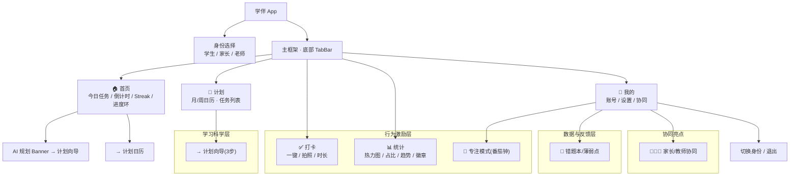
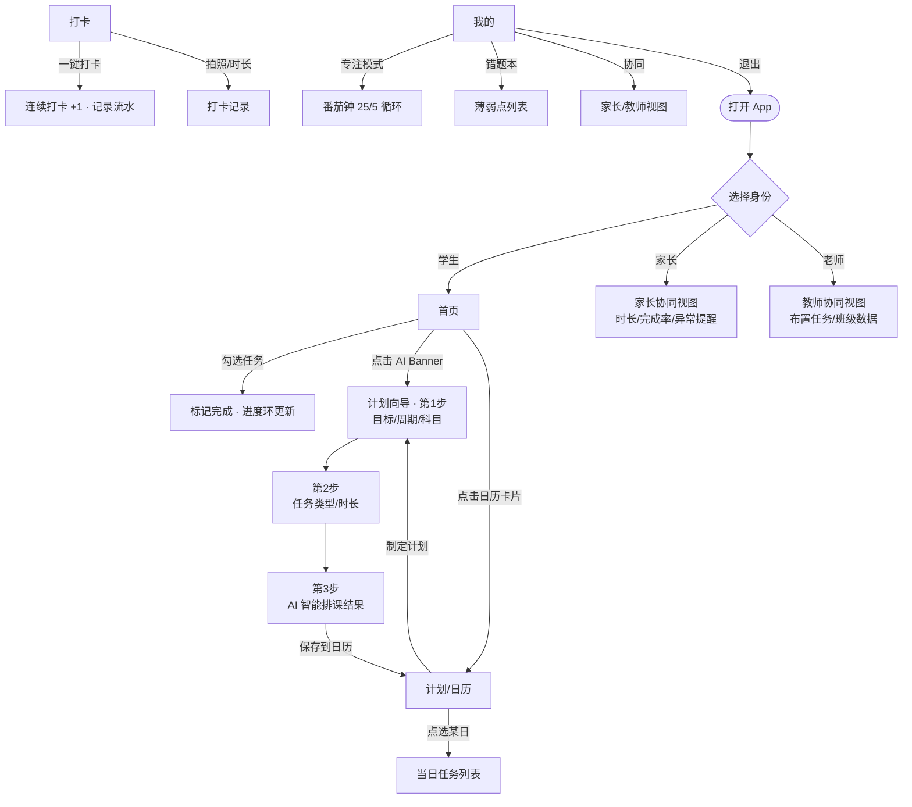
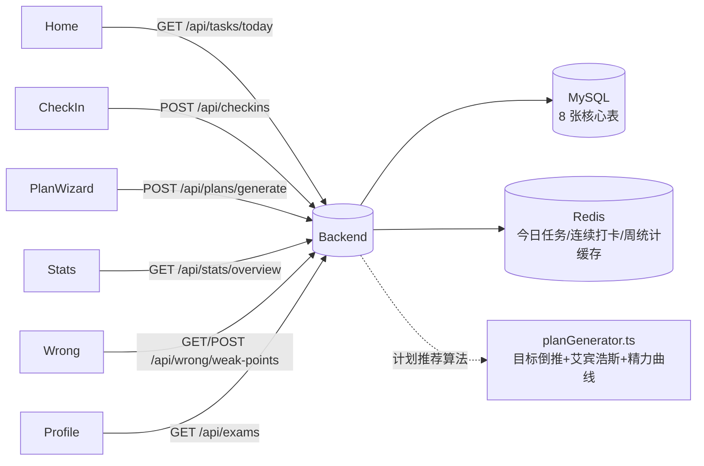

# 初高中学习计划与打卡 APP · 信息架构与页面流程图

> 配套工程：`../mobile-app/`（React Native）、`../backend/`（Node.js + MySQL + Redis）
> 设计原则：打卡操作 ≤ 1 次点击、计划制定 ≤ 3 步、护眼色系、家长/教师端不暴露学生细节。

---

## 一、信息架构图（Information Architecture）

---

## 二、核心页面流程图（Page Flow）

---

## 三、前端页面 ↔ 后端 API 调用关系

---

## 四、关键设计说明

1. **信息架构**：以「首页」为中枢，五大 Tab 覆盖方案基础层(MVP)到高阶能力；打卡作为底部中央 FAB，符合"≤1 次点击"原则。
2. **角色差异化**：学生端功能最全；家长/教师端为"只读协同视图"，仅暴露汇总指标与异常提醒，保护学生隐私（方案 2.5）。
3. **学习科学闭环**：计划向导(目标倒推) → 日历执行 → 打卡 → 统计反馈 → 错题再练，形成"计划-执行-反馈"闭环。
4. **激励与防 burnout**：连续打卡、成就徽章、学习热力图提供正向反馈；休息提醒与番茄钟防止虚假勤奋（方案 2.3）。
5. **性能**：高频读（今日任务、连续打卡、周统计）走 Redis 缓存，写操作后主动失效，降低 MySQL 压力（方案 2.4）。
